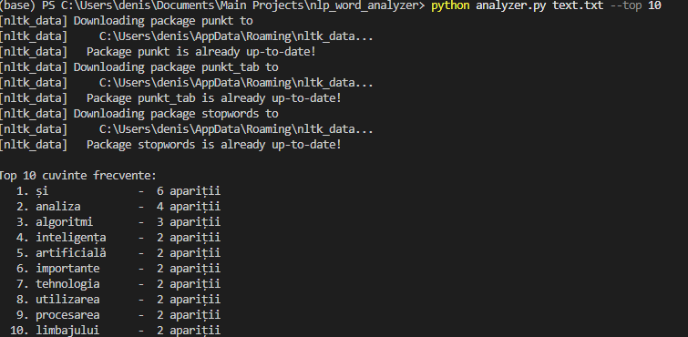
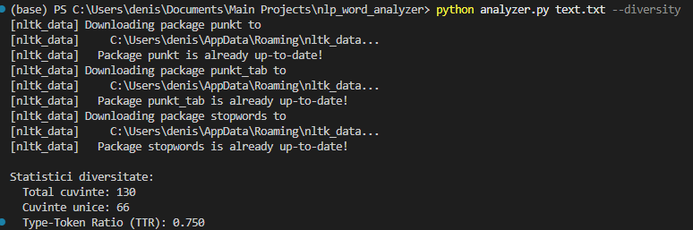
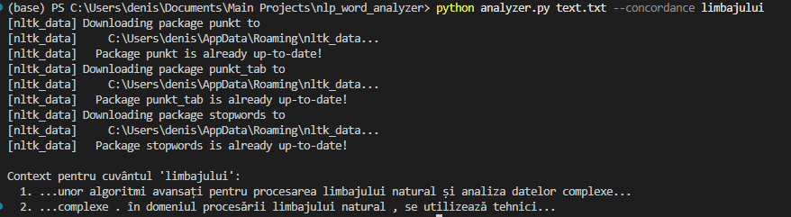

# Documentatie Tehnica - Proiect NLP Word Analyzer 2026

## Motivarea si scopul proiectului

### Motivarea
Acest proiect a fost realizat ca parte a cursului **Tehnologii AI**, la Universitatea Politehnica Timisoara, specializarea Informatica. Procesarea limbajului natural reprezintă un pilon fundamental în dezvoltarea sistemelor moderne de Inteligență Artificială.

### Scopul
Scopul principal al proiectului este de a crea un instrument capabil să proceseze texte brute pentru a extrage informații statistice valoroase. Aplicația implementează tehnici de tokenizare, filtrare a stopword-urilor și analiză de frecvență.

## Detalii de implementare

Proiectul a fost implementat folosind limbajul **Python**, utilizând biblioteci specializate pentru analiza datelor și prelucrarea textului.

### Structura codului

- **analyzer.py** - conține implementarea logicii de procesare, filtrare și calcularea statisticilor.
- **text.txt** - fișierul de intrare care conține textul ce urmează a fi analizat.
- **Dockerfile** - descrie mediul de rulare al aplicației într-un container Docker.
- **requirements.txt** - listează bibliotecile externe necesare (nltk, scikit-learn, matplotlib, wordcloud).

### Explicatie Functionalitati

1. **Analiza Textului (analyze_text)**
    - Realizează tokenizarea textului și normalizarea acestuia prin transformarea în minuscule.
    - Filtrează cuvintele comune (stopwords) pentru limbile română și engleză.

2. **Calcul Statistici si Diversitate**
    - Identifică cele mai frecvente cuvinte și calculează **Type-Token Ratio (TTR)** pentru a măsura diversitatea vocabularului.
    - Exemplu de rulare (top 10 cuvinte) în **terminal**:



3. **Verificarea Diversității Vocabularului**
    - Afișează numărul total de cuvinte, cuvintele unice și raportul TTR.
    - Exemplu de rulare pentru diversitate:



4. **Identificare Concordanta (find_concordance)**
    - Permite identificarea contextului imediat în care un anumit cuvânt este utilizat.
    - Exemplu de rulare al funcției **find_concordance** în **terminal**:



## Tehnologii Folosite

- **Limbaj de programare**: **Python**.
- **Gestionarea mediului de rulare**: **Docker**.
- **Controlul versiunilor**: **Git**.
- **Editor de cod**: **Visual Studio Code**.

## Mediul de Dezvoltare

- **Sistem de operare**: Windows 11
- **Editor/IDE**: Visual Studio Code
- **Containerizare**: Docker

## Bibliografie

1. **Curs Metode Avansate de Programare** - Exemple si materiale despre **Dockerfile** si **CI/CD**. Universitatea Politehnica Timisoara, 2025-2026.
2. **Documentatie NLTK** - Ghid oficial pentru `punkt_tab` și `stopwords`: https://www.nltk.org/.
3. **Scikit-Learn Docs** - Documentație pentru `TfidfVectorizer`: https://scikit-learn.org/.
4. **Gemini** - Asistență pentru optimizarea `Dockerfile` și structurarea documentației.

## Exemple de Rulare

### Construirea imaginii docker
```bash
docker build -t nlp-analyzer .
docker run nlp-analyzer